# Nexus Harness

A local test lab and coding assistant for your project. It writes and runs your
checks, tells you plainly what broke, and can ask a model to fix it — all on
your own machine.

Python 3.11 or newer. The core uses only the standard library: no packages to
install, no account to create, nothing sent anywhere unless you set that up
yourself.

## Two main workspaces

Nexus Harness opens around two primary workspaces. They are the centre of the
desktop app and the best place to begin:

| Workspace | Use it when you want to... |
| --- | --- |
| **AI Agent Swarm orchestrator** | Put local, command-line, and signed-in web AIs on one board; decide which projects they may work on and which agents may talk; then inspect or start their conversations. |
| **visual test automation** | Draw repeatable work as a pipeline; connect tests, gates, retries, security checks, evidence, and human decisions; then watch the real run move through the diagram. |

The distinction is useful: the **Swarm orchestrator controls who collaborates
and where**, while **visual test automation controls what runs, in which order,
and what must pass before work continues**. They can be used independently, or
together as the human-facing control layer for a local project.

### How the two workspaces fit together

Both workspaces follow the same simple path. You choose a project and describe
what you want. Nexus keeps the work with that project, shows its progress, and
keeps a clear record of what happened.

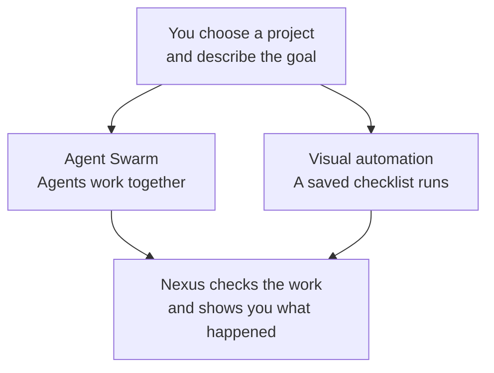

The two middle boxes are choices, not required stages. Use **Agent Swarm** when
several assistants should solve something together. Use **visual automation**
when the same steps should run reliably each time. A task can also use both.
You can follow the progress and stop the work at any time.

Web chats do not always make it clear whether the Send button worked. When
Nexus cannot be certain, it stops and tells you instead of risking sending the
same request twice.

Developers can find the internal design in
[NEXUS_WORKSPACE_RUNTIME_V2.md](docs/NEXUS_WORKSPACE_RUNTIME_V2.md). The
[acceptance criteria](docs/NEXUS_WORKSPACE_RUNTIME_ACCEPTANCE.md) and
[independent judge specification](docs/NEXUS_WORKSPACE_RUNTIME_JUDGE.md) define
what must be proven before those internals are changed.

### AI Agent Swarm orchestrator

The swarm board is a live map of agents, projects, and permission boundaries.
An agent box can represent a command-line assistant already available on the
machine or an ordinary ChatGPT, Claude, Gemini, or Microsoft Copilot web chat
opened through Nexus. A project box is a real local folder. The lines between
them are not decoration: they say which agent works on which project and which
two agents are allowed to exchange messages.

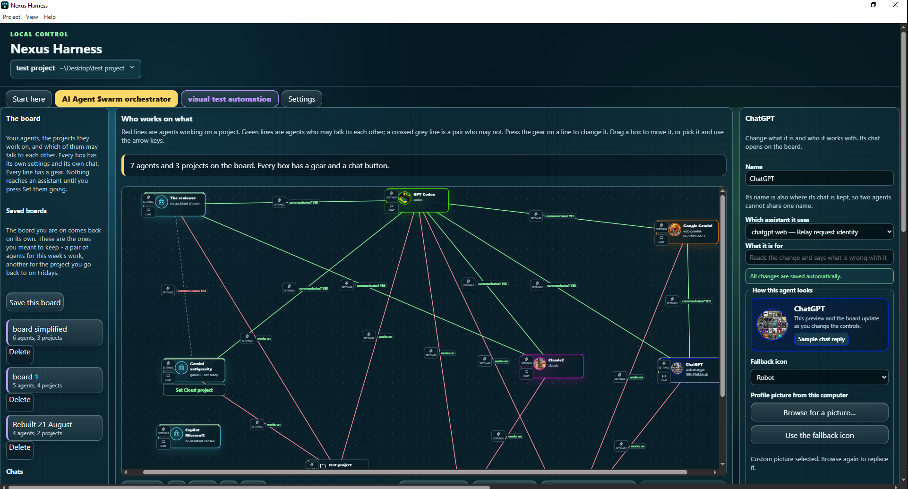

On this board you can:

- add agents and project folders, move them freely, tidy the layout, zoom, or
  fit the whole graph on screen;
- use the gear on any box or line to edit the thing it belongs to, without
  leaving the board;
- connect an agent to one or more projects, and keep each chat's file work
  bounded to a project shared by that exact pair;
- turn agent-to-agent communication on or off per pair, with the current rule
  visible on the line;
- open several compact chats at once, expand one into the full pair-chat view,
  and keep multiple separately identified conversations for the same pair;
- connect signed-in provider web chats without putting browser cookies, login
  details, or provider conversations in the repository;
- save several boards and return to a particular team-and-project arrangement
  later; and
- read the relayed messages and live activity instead of treating collaboration
  as an invisible model-side event.

Each pair chat owns its own local transcript and conversation identity. Chat 1
and Chat 2 between the same two agents remain different conversations, and a
web provider chat is bound to that Nexus conversation rather than being reused
as a global destination. The selected project is part of the conversation's
state too, so switching chats does not silently carry the previous folder into
the next one.

Ordinary chat is read-only with respect to project files. A file-changing task
uses the explicit **Work together on project files** action, gathers structured
contributions, validates the bounded transaction, checks the baseline, and
keeps rollback material. That makes the board useful for real project work
without making every message an implicit write permission.

See [AGENT_BOARD.md](docs/AGENT_BOARD.md) for the board model and
[TALK_TO_THEM.md](docs/TALK_TO_THEM.md) for conversations and collaboration.

### visual test automation

The visual automation workspace turns a runbook into an executable graph. Drag
a step onto the canvas, connect it to the next step, configure it in place, and
press **Run**. The diagram is both the editor and the live status view: nodes
light up while they run and retain the result and evidence afterwards.

Use it to build flows such as:

1. start two independent test suites in parallel;
2. scan the project for credentials or unsafe changes;
3. stop at a gate unless the required checks passed;
4. retry a flaky job with a fixed or increasing delay;
5. ask a person before a risky branch continues;
6. run another saved pipeline as one reusable step; and
7. collect the outcome and screenshots into evidence that can be reviewed or
   sent to somebody else.

The canvas supports ready-made pipelines as well as blank ones. Steps can run
unit tests, Nexus check suites, security scans, Git status inspection, evidence
packaging, assistant tasks, gates, and nested pipelines. Branches may run in
parallel; gates decide whether downstream work is allowed to start; retry and
time-limit settings keep a stuck command from owning the whole run forever.

The visual status is deliberately plain: working, passed, failed, or skipped
because a gate stopped the branch. Open a step to see its configuration and the
result that produced that colour. Saved versions let you restore an earlier
automation, and schedules can run a saved pipeline later while preserving the
same reviewable definition.

See [PIPELINES.md](docs/PIPELINES.md) for step types, gates, retries, schedules,
and evidence.

### A practical way to use both

Start in the **AI Agent Swarm orchestrator** when the question is about people
and boundaries: which assistants are available, which project is in scope, and
who may consult whom. Move to **visual test automation** when that work should
become repeatable: the build command, browser checks, security gate, review,
and evidence can be drawn once and run the same way every time.

That gives Nexus Harness two complementary control surfaces: one for a team of
agents and one for a dependable process. The older, more specialised features
are still documented below, but these two workspaces are the main product.

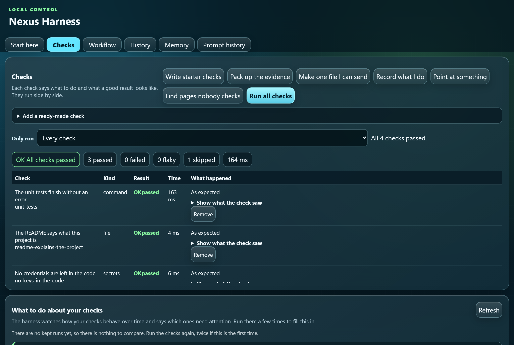

---

## Start here, on Windows

**Double-click `Install Nexus Harness.cmd`** in this folder.

That is the whole thing. It puts a **Nexus Harness** on your desktop with an
icon of its own, and from then on you double-click that. You never need this
file, or a terminal, again.

It only touches your own desktop, so nothing here needs an administrator. If
Python is not on the machine yet it says so, and where to get it, rather than
failing at you.

The icon opens the desktop app if somebody has installed it, and otherwise the
panel in your browser - and it says which of those you got. Prefer to type it?
The same thing, and it works on macOS and Linux as well:

```bash
python scripts/put_it_on_your_desktop.py
```

See [THE_THING_ON_YOUR_DESKTOP.md](docs/THE_THING_ON_YOUR_DESKTOP.md).

---

## What it does

**Writes your tests for you.** Point it at a page and click the thing you want
to check. Record yourself using the site once and get a test written from it.
Or pick from twelve ready-made checks and change one line.

**Runs them and says what happened in plain words.** Not a stack trace: "Step 2
of 5 did not work: the Sign in button. The browser said it was still hidden
after 10 seconds," and a picture of the page at that moment.

**Tells you what changed since last time.** A check that has failed all week is
not news. A check that passed yesterday and fails today is the whole story.

**Finds the pages nobody checks.** It walks your site the way a visitor would
and colours in every page: checked, only walked over, or nobody looks at it.

**Packs the evidence up.** One web page with the screenshots inside it that you
can send to anyone — no install needed to read it. Credentials are taken out
first.

---

## Install

Python 3.11+ must already be on the machine. Nothing else is needed.

```bash
git clone https://github.com/KZTP47/nexus-harness.git
cd nexus-harness
```

### Put an icon on your desktop

**Double-click `Install Nexus Harness.cmd`** in the folder you just cloned.

That is the whole thing. It puts a Nexus Harness icon on your desktop, with its
own picture, and that icon opens the panel. Nothing is installed anywhere else
and nothing outside your desktop is changed; to undo it, delete the icon.

It is at the top of the project with a name that says what it does, because the
one thing somebody who has just downloaded this cannot be expected to know is
which command to type first.

Not on Windows, or would rather type it:

```bash
python scripts/put_it_on_your_desktop.py
```

The icon opens the best thing on your machine: the desktop app if you have it,
and otherwise the panel in your browser, started by Python straight out of this
folder. It says which one you got.

### Uninstall on Windows

Double-click **`Uninstall Nexus Harness.bat`**. The same file works for every
Nexus Harness version and every Windows user because it asks Windows for that
user's own app-data, Desktop, OneDrive Desktop, and Start menu locations; it
contains no username or versioned path.

It removes the installed desktop app, the default command-line installation,
and Nexus Harness shortcuts. It is safe to run more than once. Project folders,
settings, transcripts, evidence, and signed-in provider sessions are preserved.
For unattended deployment use `Uninstall Nexus Harness.bat /S`; to inspect what
it would remove without changing anything, use
`Uninstall Nexus Harness.bat /DRY-RUN`.

### The other ways

```bash
python -m pip install .
```

Or build a single self-contained file and a launcher, with no pip and no
network:

```powershell
powershell -ExecutionPolicy Bypass -File .\scripts\install.ps1
```

```bash
sh ./scripts/install.sh
```

Or run it straight out of the folder, with nothing installed at all. The code
lives in `src`, which Python does not look in by itself, so there is a launcher
that puts it on the path for you:

```bash
python scripts/harness.py ui
```

The first command you run in a freshly cloned project stops and says the
settings file has not been trusted. That is on purpose: a settings file can name
commands to run, and nothing reads one until the person at the keyboard says the
file is theirs. Read it, then:

```bash
python scripts/harness.py trust
```

Browser and screenshot checks additionally need Node.js and Playwright. Every
other kind works without them, and a browser check says so plainly instead of
failing when they are missing:

```bash
npm install playwright
npx playwright install chromium
```

---

## One command

```bash
cd your-project
harness start
```

That reads your project, writes a starter suite from the commands you already
use, says what is still missing, and opens the panel. Press **Show me around**
on the first screen and it walks you through the rest.

The same thing, a step at a time, if you would rather:

```bash
harness qa init        # writes a starter suite from the commands you already use
harness qa run         # runs them side by side and reports
harness ui             # open the control panel in your browser
```

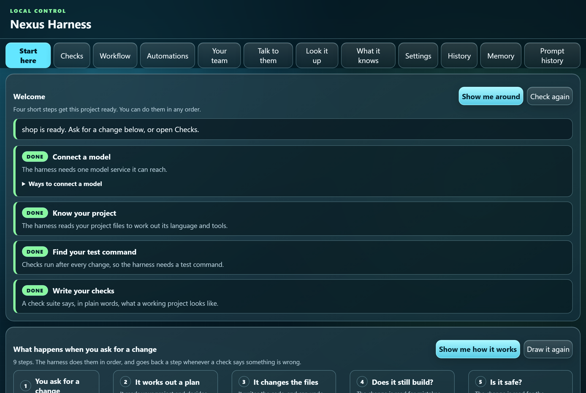

---

## See what the harness actually does

The first screen draws the whole workflow as a picture, in plain words. Press
**Show me how it works** and it walks through the steps one at a time. While a
real run is going, the same boxes light up as the work reaches them.

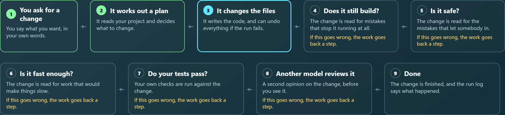

Every box is one agent or one check from the Workflow tab. Rewire it there and
this picture changes with it, because it is drawn from the workflow that will
really run — not from a drawing somebody has to remember to update.

---

## Your team

Most organisations have seats, not keys — somebody signed in to Claude,
somebody signed in to Copilot. Both come with a command line tool that is
already signed in, and the harness can drive either of them.

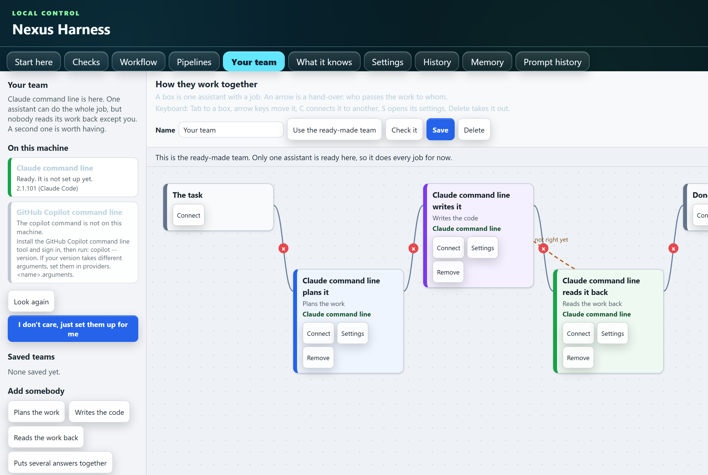

The team tab looks on your machine, says who it found and whether each one is
ready, and draws a team you can change: a box per assistant with a job on it,
an arrow per hand-over. The ready-made one has the first assistant plan the
work, the second write it, and the first read that work back — because two
assistants trained apart tend not to share a blind spot.

A job is only ever offered to an assistant really found here, and a team that
could not run is never saved. A saved team is an ordinary workflow file, so
everything that already runs a workflow runs a team.

See [YOUR_TEAM.md](docs/YOUR_TEAM.md).

## Talk to them

A box to type in, and whichever assistant you have hooked up answers.

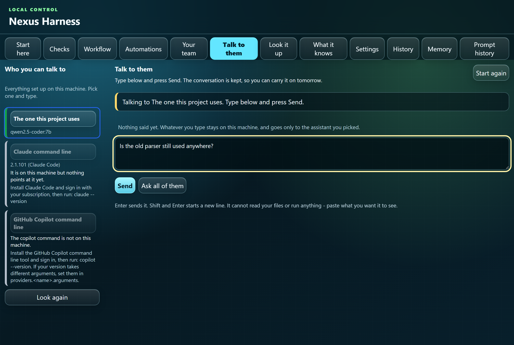

Everything set up on this machine is in the list on the left. Pick one and
type. It is a conversation, not a row of unrelated questions - what was said
before goes with the next thing you say - and it is kept, so you can close the
panel and carry on tomorrow.

**Ask all of them** puts the same question to every assistant that is ready, at
the same time, and lays the answers side by side. That is what two
subscriptions are actually for: one model's blind spot is not usually the
other's.

**Send** decides whether the selected agent should answer directly or ask its
ready, green-line-connected peers first. It can automatically relay, but it can
never change project files. You can attach bounded text files and screenshots
for the agents to inspect. **Ask connected agents** forces that relay when you
want it regardless of the automatic decision. In the full board chat, a left
pane keeps multiple durable chats for each exact two-agent pair, and each chat
has its own active-project dropdown. **Work together on project files** gathers
structured contributions from that pair and applies validated,
baseline-checked changes only to the selected shared project, with rollback backups.
Fenced code replies have a per-block **Copy code** control.
Everything typed and everything said back has credentials taken
out before it is written down, and the conversations live in `.harness/chats`,
which is never committed.

### Web AI chats

Nexus can also connect an agent to an ordinary ChatGPT, Claude, Gemini, or
Microsoft Copilot website using the subscription already signed in on this
machine. Each Nexus conversation receives its own opaque conversation key and
its own provider conversation URL, so creating Chat 2 does not silently reuse
Chat 1. Every relayed turn carries a one-use transport marker; Nexus accepts an
answer only when it follows that exact newly submitted user turn. A provider
page rerender therefore cannot turn an older answer into the answer for a new
task.

Provider pages keep rendering while they work in the background. ChatGPT,
Gemini, and Copilot use isolated Electron browser storage; Claude uses a
dedicated secure Chrome or Edge profile because its sign-in rejects embedded
Chromium. Login cookies, provider URLs, local transcripts, and browser profiles
stay in local application data and are not written to this repository. See
[WEB_AI_CHATS.md](docs/WEB_AI_CHATS.md) for setup and transport details.

See [TALK_TO_THEM.md](docs/TALK_TO_THEM.md).

## The AI Agent Swarm orchestrator

One picture of every agent you have, the projects you want worked on, and the
lines between them.

Your team finds the assistants on this machine. Talk to them puts a question to
one. The board is all of it at once, and across more than one project: which
agents you have, which projects each one is on, and which pairs are allowed to
talk to each other.

Everything is changed where it is. Every box has a gear for its settings and a
button that opens that agent's own chat, as a big box on the board beside it.
Every line has a gear too, saying **works on**, or **communicates? YES** or
**NO** - and a pair who may not talk still gets a crossed-out line, so there is
always a gear to press.

Each connected pair keeps its own set of conversations, so two pairs using the
same provider never read each other's words. Create, switch, and delete chats
from the full chat's left pane; its project dropdown names the one shared folder
that chat may change. A pair with no line between them never hears from each
other at all. **What they said to each other** lists every answer that was
passed, so you can read what each of them was actually given.

**Set them going** acts on it. Every agent is asked about the projects it is on,
one at a time, on its own. Then the ones allowed to talk are shown what the
others said and asked again, to say plainly where they disagree. That order is
the point: an agent that read the others first is not a second opinion.

See [AGENT_BOARD.md](docs/AGENT_BOARD.md).

## Look it up

Three questions about your own code, on their own tab: **where is it**, **what
uses it**, **what is it**.

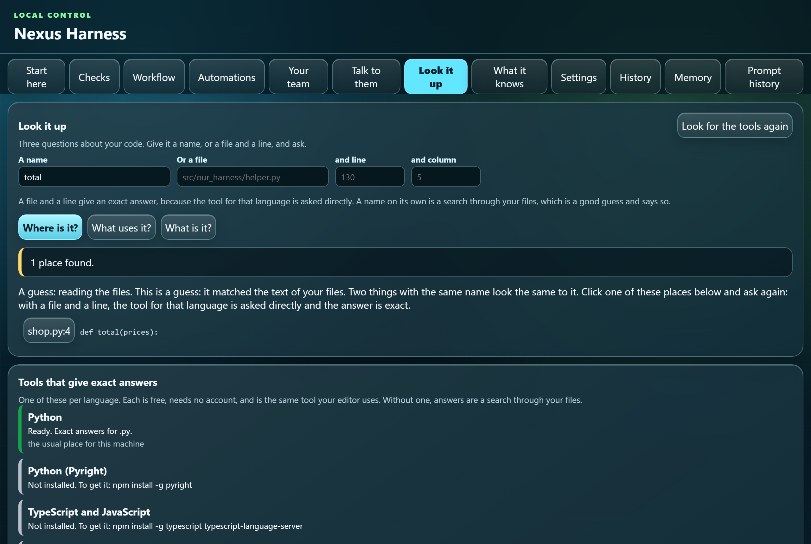

Every answer says whether it is exact or a guess. Exact means the tool built for
that language was asked — the same one your editor asks. A guess means the files
were read and the text matched, which is often right and cannot tell two things
with the same name apart. A guess called a guess is useful; a guess called an
answer sends you to the wrong place.

Give it a name and it searches. Give it a file and a line and the answer is
exact. Click any place it found and the file and line fill in for you, so the
next question is the exact one.

The panel lists the language servers it knows about, says which are installed,
and gives the one command that installs each missing one. All of them are free
and need no account. From a terminal:

```bash
harness look-up --asking what-uses-it --path src/basket.py --line 42
```

See [LOOK_IT_UP.md](docs/LOOK_IT_UP.md).

---

## What it knows about you

A harness that runs against the same project every day learns things: how you
like to be answered, which command really runs the tests here, what went wrong
last time and what fixed it. Kept in a database, that is the harness's private
business. Kept as notes, it is yours.

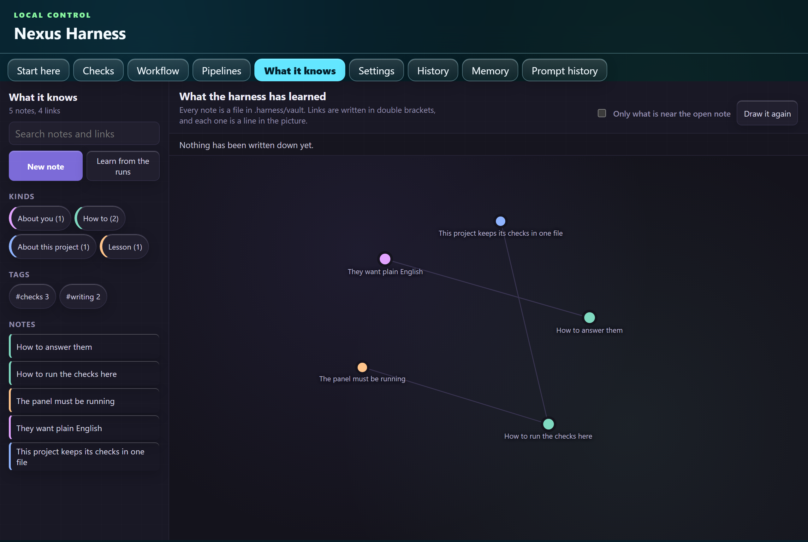

Every note is one markdown file in `.harness/vault`, with a few lines at the
top and links written `[[like this]]`. Open the folder in any editor and it is
a set of notes about your project. Nothing needs the harness to read it.

| Kind of note | What it holds |
| --- | --- |
| About you | How you like to be worked with. |
| How to | Something that worked, written down so it can be done again. |
| About this project | What the harness has worked out about the code. |
| Lesson | Something that went wrong once, and what fixed it. |

The picture is the point. A circle is a note, a line is a link, colour says
which kind, and size says how connected and how used it is. A note nothing has
touched for months is dimmed rather than believed for ever, and a link to a
note nobody has written yet is drawn as a dashed outline you can press to write
it.

**How a note earns its place.** Open one and say whether it helped. A note that
is used and goes well grows and rises; one that does not fade. That is the
whole loop: the harness writes down what worked, you correct what did not, and
what is left is true.

**Learn from the runs** reads what the harness already remembers and writes the
parts worth keeping as notes. It never writes over a note you have edited.

---

## Pipelines: many jobs, wired together

**Pipelines is the tab for automating work.** Draw each job as a box, join the
boxes with arrows, and press Run. It is the one to open when you want something
to happen without you: the checks and tests you already run, chained up, with
gates between them, tries that wait before trying again, a step that only runs
when something breaks, a stop to ask a person, and a record of every version you
have saved.

(The **Workflow** tab is a different thing: it is about how the assistants work
on one change. Pipelines is about jobs on this machine.)

A check suite answers "does this project work?". A pipeline answers a bigger
question: run these suites side by side, scan the code for credentials, only go
on if that passed, then run the unit tests, and try the flaky one again.

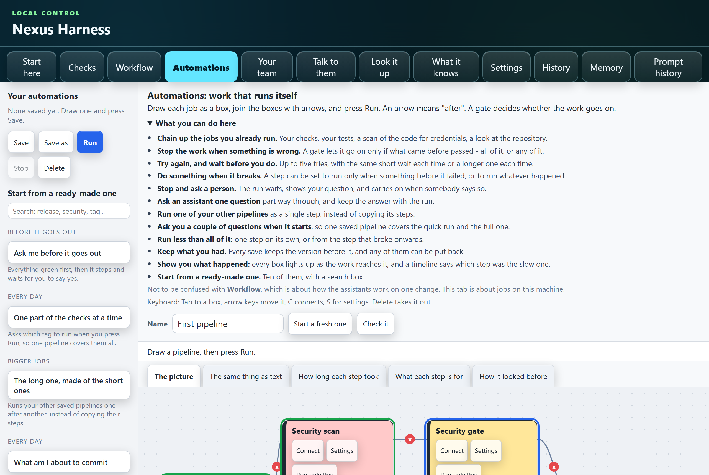

Drag steps out of the list on the left, press **Connect** on one box and then
another to join them, and press the small cross on an arrow to cut it. Each box
lights up as the run reaches it: blue while it works, green when it passed, red
when it did not, and dim when a gate stopped the work before it got there.

| Step | What it does |
| --- | --- |
| Start | Where a run begins. Everything it points at starts together. |
| Test suite | Runs your checks, or only the ones carrying a tag. |
| Unit test | Runs the project's own test, lint, or build command. |
| Security scan | Reads your files for credentials left in them. |
| Security gate | Lets the work go on only if the scans before it went well enough. |
| Gate | The same, for anything: all of what came before, or any of it. |
| Git repo | Reads which branch you are on and what is uncommitted. It never writes. |
| AI drafts a test | Asks the model you set up to write a test, and saves it as a draft for you to read. Nothing runs a draft where it is kept. |
| Keep the evidence | Writes what happened into one file you can send to somebody. |
| Ask an assistant | Keeps a provider-neutral Nexus conversation, accepts explicit file/screenshot attachments, automatically relays when connected-agent expertise would help, provides per-block code copying, and can apply an explicit bounded project-file transaction. |
| Run another pipeline | Runs one of your saved pipelines as a single step. |

Any step can be told to try again up to five times before it gives up, which is
usually enough for the one test that fails on a slow morning. It can wait
between tries — the same few seconds each time, or longer each time — because
something that failed because another thing was busy will fail again straight
away.

Every step also says **when** it runs: when everything before it passed (the
usual one), only when something before it failed, or whatever happened. The
second is for telling somebody, or putting things right. The third is for the
step that writes down what happened, which is needed most when the run went
badly. A step that was only ever there for trouble does not make a good run look
bad when it is skipped.

Five tabs over the board show the same pipeline five ways: the picture, the same
thing written out as text you can edit, a timeline of the last run, what every
kind of step is for, and how it looked before. Saving over a pipeline keeps the
one that was there — twenty of them — and any can be put back with one button,
which keeps what is on the board too.

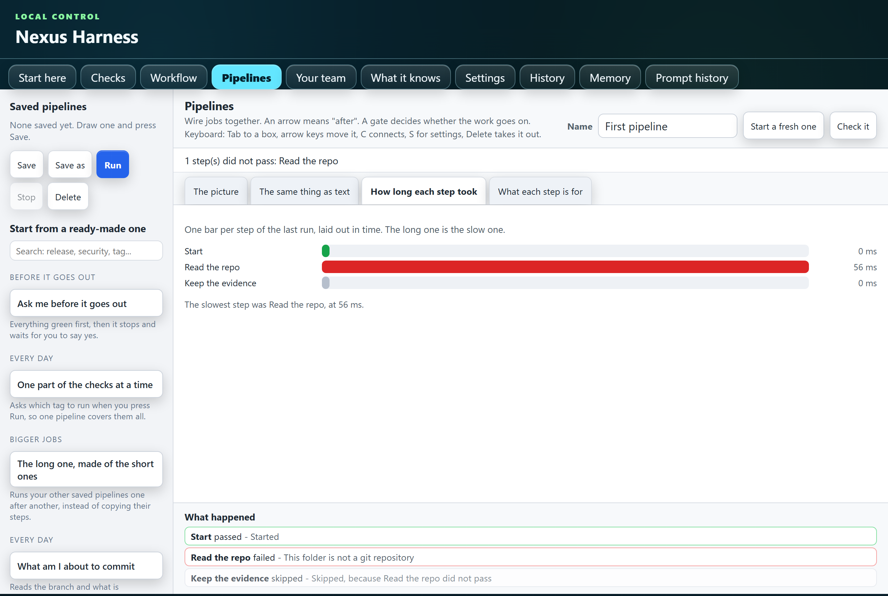

Three ways to run less than all of it, which is what you want once a pipeline is
longer than a minute:

- **Run only this** — one step, while you are building it.
- **Carry on from here** — the step that broke and everything after it. The
  earlier ones are marked *left as they were*, never *passed*.
- **Ask me first** — a step can ask about one of its settings when the run
  starts, so one saved pipeline covers "the quick ones" and "all of them".

And a step can **wait for a person**: the run stops, shows the question you
wrote, and waits for *Carry on* or *Stop here*. Ten ready-made pipelines, in
groups, with a search box over them — nobody should start from a blank board.

**And it can run itself.** Put an automation on a timer - every night, every
weekday morning, every hour - and it runs with nobody watching, with the report
waiting for you afterwards. The harness does not sit in the background: your
machine is asked to look every so often, which is why this survives closing the
window and restarting. It writes out the line for your machine and leaves the
running of it to you. See [ON_A_TIMER.md](docs/ON_A_TIMER.md).

A pipeline is ordinary JSON in `.harness/pipelines`, so it can go into your
repository and everyone gets the same one. There is deliberately no "run this
shell line" step: a saved pipeline is a file people pass around, and a file
that can run anything is a file nobody should open.

---

## "I don't care, just do it for me"

Connecting a model is a short list of instructions, and a short list is still
work if you have never done it. Every way of connecting one has a button that
does the list for you.

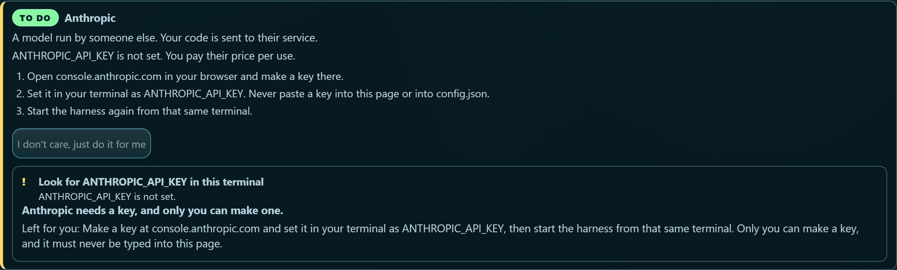

It will start Ollama if it is installed but not running, fetch the model, write
the route into your own settings file, and trust that file. It will not install
software, make an account, or ask you for a key — so it says which single part
is left for you, and where to do it. A key is never typed into the page and
never written into a settings file.

---

## Change any setting without opening a file

Everything the harness can be told, in plain words: what it is set to now,
which file that came from, and what it shipped as. Type a new value and press
Save. A setting that only counts from your own file goes there by itself, and
anything the harness would refuse is put straight back with the reason.

```bash
harness ui             # then open Settings
```

There is no list of key names to learn and no JSON to edit. A command can be
typed the way you would type it in a terminal: `pytest -q`, not
`[["pytest", "-q"]]`.

---

## When a check fails

Every failing check has a **What does this mean?** button. It turns the error
into a sentence and a short list of things to try:

```text
Nothing was listening at that address.
The check asked a server on this machine for a page, and no server answered.

Worth trying:
  - Start the thing being checked, then run the check again.
  - Look at the address in the check: a different port is the usual reason.
  - If it is the harness's own panel, run: harness ui
```

If it does not recognise a failure it says so, rather than guessing. A
confident wrong answer sends you looking in the wrong place for an hour.

---

## Carrying a setup to another machine

```bash
harness carry pack                       # writes harness-setup.json
harness carry unpack harness-setup.json  # on the other machine
```

Your checks, your pipelines and the shared settings travel. Your own settings
file never does: it names the tools on your machine, the addresses you call,
and the variables holding your keys. Nothing already on the other machine is
written over unless you say so.

---

## The seven kinds of check

| Kind | What it does |
| --- | --- |
| `command` | Runs a program and looks at how it finished. |
| `file` | Reads a file in the project and checks what is in it. |
| `http` | Asks a local server a question and checks the answer, including its shape against a JSON Schema. |
| `browser` | Opens a real page, walks through a written workflow, and watches for errors. |
| `visual` | Takes a picture of a page and compares it with one you saved. |
| `secrets` | Reads your own files and looks for credentials left in them. |
| `crawl` | Follows every link from one page and reports what is broken. |

Plugins can add their own kinds. See [docs/PLUGINS.md](docs/PLUGINS.md).

A check is ordinary JSON, so it reads like something a person wrote:

```json
{
  "id": "sign-in-works",
  "title": "A person can sign in",
  "kind": "browser",
  "url": "http://127.0.0.1:8000/",
  "steps": [
    {"do": "type", "target": "#email", "text": "someone@example.com"},
    {"do": "type", "target": "#password", "text": "example"},
    {"do": "click", "target": "#sign-in", "note": "Press sign in"},
    {"do": "expect_text", "target": "#welcome", "text": "Welcome back"}
  ],
  "expect": {"max_console_errors": 0}
}
```

---

## Which pages nobody checks

```bash
harness qa coverage --url http://127.0.0.1:8000/ --write-missing
```

It walks the site, sorts every page into checked, only walked over, or nobody
looks at it, and can write a check for each page in the last group.

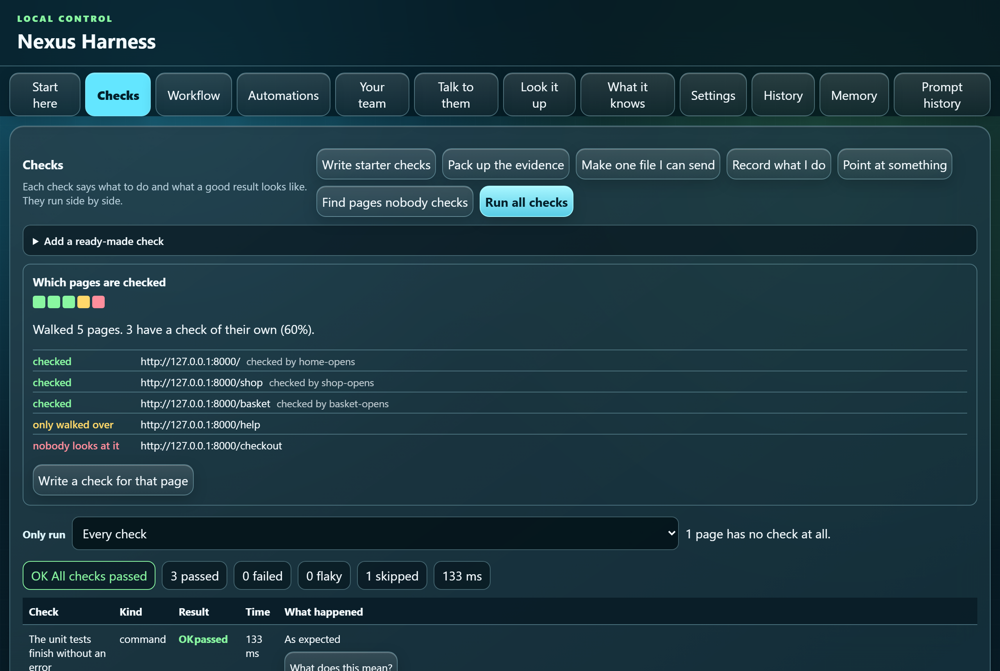

---

## What changed since the last run

```bash
harness qa changed
```

Only what moved: what started failing, what got fixed, what is new, what went
away, and what got a lot slower. A check that was already failing is mentioned
at the end, not the top.

---

## One file you can send to anyone

```bash
harness qa share
```

One web page holding the results and the screenshots, openable on a machine
that has never seen this project. Credentials, your own folder names, and
terminal colour codes are all taken out first.

---

## Asking a model to make a change

This part is optional and off until you set up a model.

```bash
harness doctor                      # says what is missing and how to fix it
harness run "Fix the failing parser test"
```

The harness plans the change, edits the files, runs your checks, reviews the
result, and tries a bounded number of repairs. Files are restored if a run
fails. `--dry-run` plans without touching anything.

You can rewire who does what, and in which order:

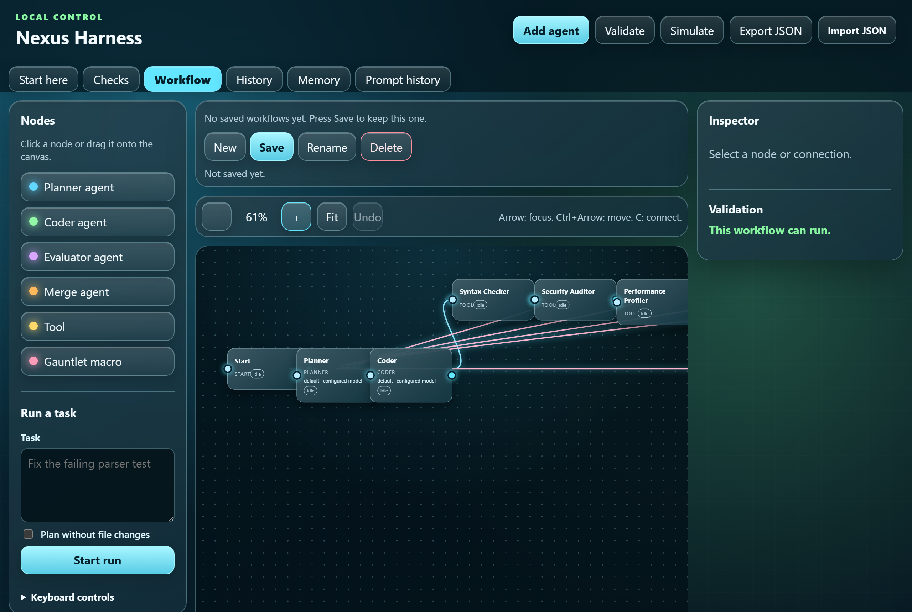

Model services it can use: Ollama or any OpenAI-compatible server on your own
machine; OpenAI, Anthropic or Gemini with your own key; or the Claude and
GitHub Copilot command lines, which use a seat your organisation already pays
for and need no key at all. See [docs/SUBSCRIPTIONS.md](docs/SUBSCRIPTIONS.md).

A model on your own machine needs no seat and nobody's permission at all, and the
app now finds them for you - see
[docs/LOCAL_MODELS.md](docs/LOCAL_MODELS.md).

---

## Worked example: two subscriptions on one job

Plenty of organisations have Claude and Copilot seats and no API keys, and never
will. Both of those ship a command line tool that is already signed in, so the
harness can put them on the same job: Claude plans and reviews, Copilot writes
the code, and the two send notes to each other as they go.

### The short way: let it set itself up

Open `harness ui`, stay on the Start view, and work down the three steps.

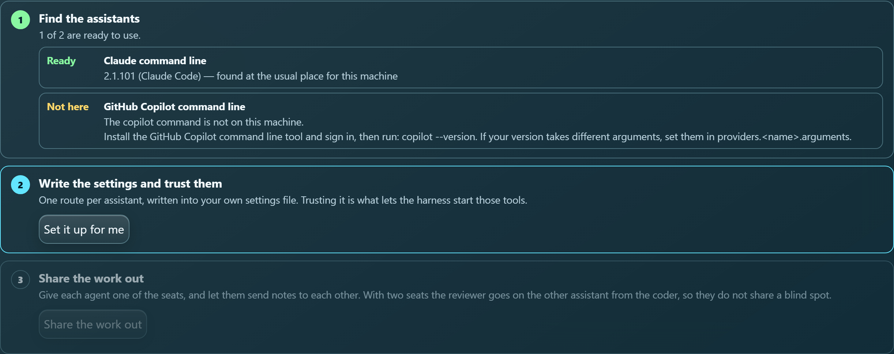

1. **Find the assistants.** It looks for each tool on this machine, asks its
   version, and says which ones are ready. If one is missing it tells you what
   to install.
2. **Write the settings and trust them.** One button writes a route per
   assistant into your own settings file and marks the file as yours. It shows
   you exactly what it wrote, and **Put my settings back** undoes it.
3. **Share the work out.** One button gives each agent in the workflow on
   screen a seat, lets them send notes to each other, and — when you have two
   assistants — puts the reviewer on the other one from the coder.

Same thing without the screen:

```bash
harness seats list      # what is on this machine
harness seats setup     # write the routes and trust the file
```

### The long way: do it by hand

Useful when your tools take different arguments, or you want to see every part.

**1. Check both tools are installed and signed in.** They are separate products
from the subscriptions, and each signs in on its own.

```bash
claude --version        # 2.1.101 (Claude Code)
copilot --version
```

**2. Name one route per seat** in `.harness/config.local.json` — your own file,
never shared:

```json
{
  "providers": {
    "claude":  {"kind": "claude-cli",  "model": "claude-sonnet-4-5", "endpoint": ""},
    "copilot": {"kind": "copilot-cli", "model": "gpt-5",             "endpoint": ""}
  },
  "provider": {"name": "claude-cli", "model": "claude-sonnet-4-5",
               "endpoint": "", "api_key_env": ""}
}
```

`endpoint` stays empty: a signed-in tool has no address to call.

**3. Say the file is yours.** Until you do, the harness refuses to use it:

```text
error: providers.claude.kind requires trusted local, user, environment,
explicit, or command-line config
```

```bash
harness trust
harness doctor          # OK provider: Provider configuration is present: claude-cli
```

**4. Give each agent a seat.** Open `harness ui`, go to the Workflow tab, and
set the **Provider route** on each agent box:

| Agent | Route |
| --- | --- |
| Planner | `claude` |
| Coder | `copilot` |
| Final Reviewer | `claude` |

A reviewer on a different assistant from the coder is the whole point. Two
models that share no training tend not to share the same blind spot.

**5. Let them talk.** Tick `team.message` on each agent. Then one can tell
another what it found:

```json
{"to": "coder", "subject": "The parser caches by file name",
 "body": "Two files with the same name share a cache slot. Key on the full path."}
```

**6. Press Start run.** That runs the workflow you have on screen. The finished
setup routes like this:

```text
planner  -> route claude   = claude-cli claude-sonnet-4-5
coder    -> route copilot  = copilot-cli gpt-5
review   -> route claude   = claude-cli claude-sonnet-4-5
```

Subscription work is recorded as `subscription-unpriced` — there is no price
per request, so the harness does not invent one. Your plan's own rate limits
still apply.

Full walkthrough, including what to do when a tool takes different arguments:
[docs/TWO_SEATS.md](docs/TWO_SEATS.md).

---

## Running in a build server

```bash
harness qa ci github          # writes the workflow file
harness qa ci gitlab
harness qa run --format junit --output report.xml
```

Reports come out as JSON, Markdown, JUnit XML, or a single HTML page.

---

## Every command

```text
harness start                       Set a project up and open the panel, in one go
harness init                        Scan a project and write its settings
harness doctor                      Say what is missing and how to fix it
harness run <task>                  Plan, edit, test, review, repair
harness ui                          Open the control panel
harness qa init                     Write a starter suite from your own commands
harness qa run [--tag|--case ...]    Run the checks side by side
harness qa watch                    Run them again whenever a file changes
harness qa coverage --url <address> Which pages have no check at all
harness qa changed                  What moved since the run before
harness qa share                    One page of a run you can send to anyone
harness carry pack                  Pack this setup up to carry to another machine
harness carry unpack <file>         Write a carried setup into this project
harness qa record --url <address>   Do a workflow by hand and get a check from it
harness qa pick --url <address>     Click a thing and get a name a check can use
harness qa starters | add <name>    Ready-made checks
harness qa baseline                 Save today's screenshots as the ones to match
harness qa explain                  Ask your model why a check failed
harness qa flaky | advise           Which checks need attention, and why
harness qa ci github|gitlab         Write the file a build server needs
harness bundle                      Zip the evidence to send on
```

`harness <command> --help` explains any of them.

---

## What it will not do

It will not run a command your settings deny, and the deny list has a floor it
cannot be talked out of: nothing formats a disk or shuts down a machine, whatever
a project's own settings say.

It will not read or write outside your project folder.

It will not send anything anywhere until you configure a model, and it takes
credentials out of everything it writes for a person to read or pass on.

Project settings that could run something — provider commands, test commands,
plugins — are refused unless the file they come from is trusted on this machine.
Cloning a repository never gives that repository the right to run code.

---

## Documentation

| Guide | About |
| --- | --- |
| [QA.md](docs/QA.md) | Checks, in full: every kind, every option, every command |
| [PIPELINES.md](docs/PIPELINES.md) | Automating work: jobs as boxes, arrows between them, and it runs itself |
| [TALK_TO_THEM.md](docs/TALK_TO_THEM.md) | Typing to the assistants you have hooked up, one or all at once |
| [WEB_AI_CHATS.md](docs/WEB_AI_CHATS.md) | Connecting provider websites, including Claude's secure browser transport |
| [ON_A_TIMER.md](docs/ON_A_TIMER.md) | Having an automation run itself, with nobody watching |
| [WHEN_IT_IS_STUCK.md](docs/WHEN_IT_IS_STUCK.md) | Noticing a run going round in circles, and seeing what it is doing |
| [INSIDE_YOUR_EDITOR.md](docs/INSIDE_YOUR_EDITOR.md) | Working inside an editor you already have open |
| [BEING_TOLD.md](docs/BEING_TOLD.md) | Being told when a run finishes. The one part that needs a key |
| [YOUR_PROJECTS.md](docs/YOUR_PROJECTS.md) | Which project you are on, and switching between them |
| [LOOK_IT_UP.md](docs/LOOK_IT_UP.md) | Where is it, what uses it, what is it - in your own code |
| [WHAT_IT_KNOWS.md](docs/WHAT_IT_KNOWS.md) | The notes the harness keeps about you and your project |
| [YOUR_TEAM.md](docs/YOUR_TEAM.md) | The assistants on your machine, and how to make them work together |
| [WHAT_WE_COULD_ADD.md](docs/WHAT_WE_COULD_ADD.md) | What two other harnesses have that this one does not, and what each is worth |
| [CONFIGURATION.md](docs/CONFIGURATION.md) | Every setting and where it may come from |
| [SECURITY.md](docs/SECURITY.md) | What is fenced off, and how |
| [SUBSCRIPTIONS.md](docs/SUBSCRIPTIONS.md) | Using a Claude or Copilot seat instead of a key |
| [TWO_SEATS.md](docs/TWO_SEATS.md) | Two subscriptions on one job, step by step |
| [CONTROL_PANEL.md](docs/CONTROL_PANEL.md) | The panel and the workflow editor |
| [DESKTOP.md](docs/DESKTOP.md) | The desktop app |
| [ARCHITECTURE.md](docs/ARCHITECTURE.md) | How the parts fit together |
| [PLUGINS.md](docs/PLUGINS.md) | Adding your own kind of check |
| [ACCESSIBILITY.md](docs/ACCESSIBILITY.md) | Keyboard and screen reader support |

---

## Working on the harness itself

```bash
PYTHONPATH=src python -m unittest discover -s tests -t tests -q
```

1324 tests, no test dependencies beyond the standard library. The project also
checks itself with its own tool:

```bash
PYTHONPATH=src python -m our_harness qa run --suite .harness/qa/suite.json
PYTHONPATH=src python -m our_harness qa run --suite .harness/qa/workflows.json
PYTHONPATH=src python -m our_harness audit
```

The second of those is 67 browser checks over the control panel. Three guards
keep the panel honest: every control has to be really used by a check, every
kind of news the server sends has to be one the page listens for, and no check
may lean on data the panel can replace underneath it.

To retake the screenshots in this file:

```bash
python scripts/make_screenshots.py
```

---


