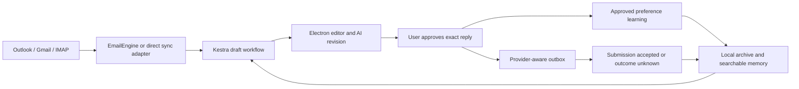

# Email assistant architecture decision

Research and implementation decision date: 2026-09-12. Three independent research agents compared mailbox infrastructure, memory and complete applications. The parent inspected decisive upstream source, current Nexus code and synthetic storage evidence. The selected path now has managed local and external EmailEngine integration, automated contract tests and a synthetic native SMTP proof; this is not certification of real mailbox delivery or unattended operation. No real mailbox or recipient was used in the EmailEngine runtime experiment.

Latest user amendment: licensing is handled by the legal department and is excluded from technical ranking. Earlier license findings are not implementation blockers. The following recommendation supersedes the initial licensing-filtered ranking.

## Recommendation

**Selected API infrastructure: EmailEngine with persistent Redis, behind Nexus's existing editor, AI routes, indexed memory and Kestra.** Windows supports managed on-demand portable provisioning; an external service remains available. The user's subsequent amendment also selects browser automation as a registration-free connection choice, with visible/headless modes and reviewed sending through supported Outlook/Gmail DOM layouts. Classic Outlook retains export-only sending. Browser layout/authentication fragility and its limited inbox scan remain explicit tradeoffs. Inbox Zero remains the whole-application alternative from the comparison, not a second overlapping mailbox owner to bundle alongside EmailEngine.

The external service path was the initial baseline. A later native EmailEngine plus community Redis Windows experiment proved queue persistence and synthetic SMTP delivery, and the product's managed provisioning module then passed actual startup/restart with protected credentials. The adapter supplies mailbox discovery, paginated Inbox reconciliation, reply references, queued submission and outcome checks. Nexus's desktop workflows still need a running, awake computer. Portable binaries solve a deployment dependency; they do not supply publisher OAuth registrations or prove end-to-end mailbox operation.

## Implementation evidence and newly discovered issues

- Official EmailEngine 2.80.1 native executable: 144,507,309 bytes, verified against its release SHA256. A full additional payload has not been measured inside the 400MiB installer budget; no untested server bundle was added.
- Docker Desktop could not start on the test host; no usable WSL Redis installation was available. This is a host experiment result, not a universal Windows limitation.
- Memurai supports console operation, but an automatically provisioned artifact was not obtained. Its developer runtime also self-stops after ten days, which prevents an unlimited-uptime claim for that build independently of legal clearance.
- Microsoft Garnet 2.1.7 with Lua transaction mode and persistent AOF allowed EmailEngine health, API-token issuance and authenticated account/outbox listing. **Queue workers then failed on unsupported `XREAD BLOCK` and delayed synthetic submission timed out.** It is rejected as the EmailEngine backend. Liveness did not prove queue compatibility.
- The probed EmailEngine executable reported inactive runtime entitlement and limited mode, but the tested single-account queue and SMTP path worked. Licensing is excluded from ranking, per the user; broader runtime capabilities still need verification rather than assuming either unrestricted use or total failure.

### Subsequent portable Redis success

The community [redis-windows/redis-windows 8.10.1 Cygwin build](https://github.com/redis-windows/redis-windows/releases/tag/8.10.1) supplied a practical alternative to Garnet. The 14,769,085-byte archive matched release SHA256 `5532f2cc38a0185556b648d25a0c2ff1cc58029f37fd76eceb38736976dcb056`. It packages Redis source for Windows with Cygwin; this is not an official Redis Windows support claim. It started without a global installation, using project-owned storage, loopback binding and persistent AOF.

Against that real server, EmailEngine 2.80.1 passed synthetic account creation, queue submission, duplicate idempotency-key reuse, persisted queue recovery after stopping/restarting both processes, and actual delivery of exactly one expected message to a private loopback SMTP test server. No real mailbox or recipient was used. Inactive entitlement did not prevent that single-account experiment; unrestricted production capability is still not demonstrated. The probe's relevant receipt is retained privately with the implementation evidence.

One new issue surfaced: successful `/health` preceded account worker readiness after restart, and an immediate submission returned HTTP 503. A bounded readiness wait allowed the same synthetic test to succeed. Service liveness must therefore not be presented as account readiness, and ambiguous-send protection must remain intact. This result makes on-demand verified portable provisioning technically credible while leaving clean installation, production workload, authentication, backup/recovery and long-running acceptance tests outstanding.

The actual `ManagedEmailEngine` module was subsequently tested in a fresh arbitrary project root with real Windows DPAPI. Its normal artifact verification/extraction accepted preseeded pinned download files; Redis accepted password-protected stdin configuration; a generated 64-character token authorized the API. Closing/restarting preserved the URL, token, protected settings and a synthetic account. That verifies the managed product lifecycle with real executables. Network download, packaged UI, provider authentication and full mail workflow evidence must still be assessed separately; it is not a clean-machine certification.

Automated tests cover adapter contracts and synthetic service lifecycle, including persistence/identity boundaries and restart ownership. Real supported Redis plus EmailEngine mailbox arrivals, threaded recipient delivery, authorization renewal/revocation and a measured 72-hour soak remain unverified. A connected service or passing unit test must not be described as all six product requirements being fulfilled.

### Ingestion and outcome semantics

Current Nexus/EmailEngine ingestion periodically advances an Inbox page and checks the head page, persisting deduplicated mail and continuation state. It is not a durable webhook subscription. An email removed before polling can be missed. Initial history does not flood the user with drafts; eligibility depends on the message timestamp relative to a connection baseline. Invalid timestamps are history, and delayed/backdated arrivals can require a manual draft. Pagination removes the browser's first-50 limitation but does not establish complete capture under arbitrary mailbox churn.

EmailEngine queue acceptance, provider acceptance, recipient delivery and file export are distinct events. Nexus persists an approved submission intent and stable idempotency key before sending. Server idempotency retention is finite; timeout recovery must not assume a permanent exactly-once guarantee. Unknown outcomes and missing outbox entries never authorize automatic resubmission. EmailEngine can retry its existing queued job under its own configured policy, without Nexus creating a new send. Approved style feedback may be learned separately from delivery, while exported or merely queued replies must not be used as confirmed sent history.

## Historical comparison rationale

For memory, use an indexed mail archive and versioned attributable preferences owned by Nexus, with evaluated semantic retrieval. Consider Inbox Zero's learning approach and Agents From Scratch's human-review workflow. Treat LangMem as an optional extraction/search helper behind a Nexus adapter, not the owner of durable memory. Mem0 remains an alternative experiment. Avoid operating duplicate mail-sync owners or two independent send queues for the same account.

This revises the earlier suggestion to bundle full official SDKs and LangMem immediately. Existing Nexus source already implements Graph delta and Gmail history synchronization. SDKs expose APIs; they do not supply the application's recovery, reply correctness or learning policy. LangMem also requires a durable store and a structured model adapter that our plain-text CLI completion interface does not currently provide.

## Revised technical shortlist with licensing excluded

**Path A: Inbox Zero as a companion service, initially using its existing UI inside Nexus.** This is the leading whole-product reuse experiment: existing Outlook/Gmail handling, drafting, sending and generated-versus-sent learning cover the greatest share of the requested behavior. Source also provides optional [Codex CLI and Claude Code adapters](https://github.com/elie222/inbox-zero/blob/f298bd482b7e218614c4a45f265b95fdf413f0f0/apps/web/utils/llms/cli-provider.ts); API-key-only would be an incorrect description. Those adapters require explicit enablement and additional provider packages, and Windows/container authentication must be tested. A backend-only integration into the current editor needs a Nexus facade: the documented public API does not expose the complete mail/draft/memory workflow. Its history retrieval is bounded, so comprehensive semantic memory remains a test requirement. Do not operate Nexus and Inbox Zero as competing send/draft owners for the same mailbox.

**Path B: EmailEngine mailbox service plus Nexus's existing editor, Kestra and memory.** This is the leading modular architecture when preserving Nexus UI and orchestration matters most. EmailEngine offers [queued events](https://learn.emailengine.app/docs/webhooks/overview), [reply references](https://learn.emailengine.app/docs/sending/replies-forwards), and [stored-draft submission](https://learn.emailengine.app/docs/sending/basic-sending) that directly replace missing mailbox infrastructure. It does not supply the AI memory/editor. Its [Windows executable](https://learn.emailengine.app/docs/installation/windows) still needs Redis-compatible storage; an always-on backend simplifies desktop provisioning, while a bundled local pair requires measured setup/lifecycle work. Documented OAuth setup uses confidential web application credentials: verify a public-client/external-token path for a local bundle or keep confidential credentials on the backend. Never ship a publisher secret in the installer. [OAuth setup](https://learn.emailengine.app/docs/accounts/oauth2-setup).

**Path C: improve the current direct connectors and native memory.** This remains the smallest deployment footprint and avoids a second application stack, but Nexus retains the most sync/outbox engineering responsibility. It is the baseline against which A and B should be measured, not the automatic winner because code already exists.

The comparison favored **A** for maximum whole-application reuse, **B** for preserving the Nexus experience, and **C** for minimum local deployment dependencies. The implementation selected **B with external or managed local service ownership**. Clean-machine and real-mailbox acceptance gates remain outstanding. Do not bundle A and B together by default: both would own overlapping mailbox functions, and compatibility would require another adapter.

## Candidate decisions

| Path | Useful contribution | Decisive limitation for Nexus | Decision |
|---|---|---|---|
| Existing REST with official Graph/Gmail APIs | Layout-independent inbox synchronization and actual sending | Publisher registration, queue recovery and correct reply semantics still required | Best lightweight desktop alternative |
| Full Graph/Google SDKs | Typed APIs and ecosystem support | Duplicate existing API access, additional dependencies and payload | Adopt only for a demonstrated maintenance/reliability benefit |
| ImapFlow + Nodemailer | IMAP IDLE and mature SMTP/MIME support | IMAP authentication, reconnect/checkpoints and outbox remain ours; adds Node protocol worker | Candidate for broader-provider fallback |
| LangMem | Extraction, consolidation and memory search tools | Durable backend and CLI structured-tool adapter required | Optional measured experiment after storage contract |
| Mem0 OSS | Managed extraction/search primitives and pluggable storage | Default API providers, telemetry and new dependencies; OSS is not identical to hosted product | Alternative experiment, not default |
| SQLite FTS5 plus optional embeddings | Local deterministic ownership, provenance and low incremental dependency cost | FTS alone misses semantic paraphrases; AI learning and embeddings still need engineering | Memory foundation, with explicit semantic upgrade gate |
| Agents From Scratch | Close example of email, user review and feedback memory | Educational, Gmail-focused; not production Outlook infrastructure | Reuse permitted patterns with attribution; do not ship demo stack wholesale |
| Executive AI Assistant | Email-review/memory example | Archived and Gmail-focused | Reference only |
| Inbox Zero | Closest broad product, including sent-draft feedback concepts | Separate server/UI/data/scheduler stack; CLI route and Windows packaging adaptation | Best complete product candidate; compare full adoption with selective subsystem reuse |
| Mail-0/Zero | MIT email client/UI | Inspected Outlook subscription methods throw not-implemented errors | Does not solve our Outlook arrival requirement as shipped |
| EmailEngine | Unified mailbox sync, queued notifications, outbox and provider-aware replies | Redis-compatible service, packaging and lifecycle; no AI memory/editor | Best prebuilt mailbox subsystem; first technical prototype |

Relevant primary sources: [Graph SDK](https://github.com/microsoftgraph/msgraph-sdk-python), [Google client](https://github.com/googleapis/google-api-python-client), [ImapFlow](https://github.com/postalsys/imapflow), [Nodemailer](https://github.com/nodemailer/nodemailer), [LangMem](https://github.com/langchain-ai/langmem), [Mem0](https://github.com/mem0ai/mem0), [SQLite FTS5](https://sqlite.org/fts5.html). License decisions belong to the legal department, per the user's instruction.

The parent independently inspected [Zero's Outlook subscription implementation at a fixed commit](https://github.com/Mail-0/Zero/blob/64c5480c341750578da0746f2db9ad84da686334/apps/server/src/lib/factories/outlook-subscription.factory.ts), the [Agents From Scratch MIT license](https://github.com/langchain-ai/agents-from-scratch/blob/603fc7a4ac6119004f43894395e504a1fefcc6c0/LICENSE), and [EAIA's archived status](https://github.com/langchain-ai/executive-ai-assistant). See [Inbox Zero's actual license](https://github.com/elie222/inbox-zero/blob/main/LICENSE) and [EmailEngine's licensing statement](https://github.com/postalsys/emailengine), rather than treating a public repository as unrestricted open source.

## Existing source findings that change the decision

`email_connectors.py` already contains OAuth PKCE, Graph next/delta links, Gmail initial/history paging and expired-cursor recovery. However, `EmailStudio._sync` consumes one page and drops `has_more`, so catch-up competes with the normal poll interval. It does not yet distinguish historical backfill for memory from new arrivals eligible for automatic drafts. A new SDK alone fixes neither issue.

Normalized mail currently loses Reply-To, Internet Message-ID, References and provider conversation metadata. `finalize_draft` creates a new message with a Re subject and addresses it to the sender. This is not sufficient to guarantee the correct recipient or conversation. Graph has [native reply drafts](https://learn.microsoft.com/en-us/graph/api/message-createreply?view=graph-rest-1.0); Gmail specifies [thread ID and reply-header requirements](https://developers.google.com/workspace/gmail/api/guides/threads). Provider-native drafts require an explicit permission decision, including Graph Mail.ReadWrite. Export-only connectors must continue to say export.

The memory table is durable, but selection uses unordered records and bounded same-sender slices. The best first improvement is a retrieval contract: account/thread/sender filters, deterministic ranking and dates, relevance queries across retained history, source attribution, explicit corrections and superseded preferences. An incoming assertion is not a confirmed personal fact. A user-approved style change can inform preferences even when exported, but export must never be represented as sent correspondence.

Our AI interface returns plain text through Claude/Codex CLI. LangMem's [source](https://github.com/langchain-ai/langmem/blob/main/src/langmem/knowledge/extraction.py) expects BaseChatModel/tool binding for relevant operations. Matching LangGraph version constraints is not a working adapter. Mem0's [telemetry source](https://github.com/mem0ai/mem0/blob/main/mem0/memory/telemetry.py) defaults telemetry on; any trial must explicitly configure network behavior, storage and model providers. This is a configurable integration issue, not evidence that email bodies are sent by telemetry.

## Coverage of the user's six requirements

| Requirement | Proposed owner and behavior | Evidence still needed before calling it working |
|---|---|---|
| 1. Works for ordinary users | Publisher-configured sign-in; provider capability status; clean Windows installation | Personal/work Outlook and consumer/Workspace Gmail setup, blocked-consent handling, no developer environment |
| 2. AI triggers for new inbox mail | Durable ingest/checkpoint transaction and job queue; immediate bounded pagination; restart recovery | Bursts beyond 50 messages, crash boundaries, expired cursors, throttling and sleep/wake |
| 3. AI generates a draft | Existing Kestra plus selected CLI route, durable deduplication key and observable failure state | One active draft per eligible arrival across retries; historical backfill does not flood drafts |
| 4. Remembers earlier mail | Canonical local archive plus rebuildable lexical/semantic index | Relevant older and cross-sender retrieval, paraphrases, account isolation and restart |
| 5. User edits with AI and answers in Electron | Existing revision-protected editor plus provider-aware outbox tied to exact approved content | Real threaded reply, Reply-To, send approval and ambiguous-submission reconciliation |
| 6. Remembers draft preferences | Approved-edit extraction with source/revision/scope and correction policy | Later drafts apply valid preferences; one-off facts and unapproved/incoming instructions do not become preferences |

## Proposed execution flow

Provider acceptance is not recipient delivery. Graph [sendMail documentation](https://learn.microsoft.com/en-us/graph/api/user-sendmail?view=graph-rest-1.0) explicitly distinguishes acceptance from completed processing. Persist an outbox intent before submission, avoid blind retries after ambiguous failures, and reconcile using provider identifiers and Sent Items where possible. Record factual submission state separately from learned communication preferences.

## Setup and deployment boundaries

Normal setup should be Connect Outlook/Gmail, browser authentication/consent, then connected. Nexus's publisher supplies non-secret application IDs; users should not type them in the ordinary flow. Public application IDs and provider endpoints are portable configuration, not personal machine hardcodes. Organization consent policy can still require an administrator. No repository can derive a Nexus app registration from an existing Outlook browser login. [Microsoft desktop configuration](https://learn.microsoft.com/en-us/entra/identity-platform/scenario-desktop-app-configuration).

Gmail production access may require restricted-scope verification and an assessment based on the actual data flow. Sending mail context to a remote AI means we cannot assume a local-only exemption. [Google requirements](https://developers.google.com/identity/protocols/oauth2/production-readiness/restricted-scope-verification). This is a release prerequisite to resolve for the selected architecture, not a reason to ask every user to configure OAuth manually.

A tray/background process can keep working with the window closed while Windows is awake. Processing during power-off needs an optional always-on backend with the same mailbox/job contract. Start with durable polling and catch-up for the desktop; webhooks add a public endpoint, renewals and reconciliation rather than removing them. Browser scraping remains a fallback with explicit reduced guarantees.

Private accounts, tokens, profiles, mail archives and embedding data stay in runtime storage and out of packages. Index schema and model/embedding contract changes must invalidate or migrate generated indexes without losing canonical mail. Distribution needs pinned dependencies, license notices and installer size verification.

## Evidence and confidence

The parent queried live PyPI metadata without installing packages. Observed compressed single-wheel sizes: LangMem 0.0.30 = 67,122 bytes; Mem0 2.0.20 = 345,797; Graph SDK 1.62.0 = 28,933,842; Google client 2.200.0 = 16,082,149. These exclude dependencies and are not incremental installer-size measurements. Receipt: `reports/email-options-dependencies.json`.

The parent read and reran `reports/email-options-memory-probe.py` using the bundled Python. SQLite 3.45.1 supported FTS5, reopening the database, scoped retrieval and explicit versioned preference supersession. The negative control demonstrated that searching brief did not find concise. This proves a storage primitive is available and lexical retrieval alone is insufficient; it does not prove AI conflict resolution, semantic quality or implemented Nexus memory.

Agent evidence is retained in `reports/email-options-mailbox.md`, `reports/email-options-memory.md`, and `reports/email-options-applications.md`. Primary source inspection and synthetic feasibility support this recommendation. No candidate stack was installed or certified end-to-end, and there was no new live-send test.

## Original proposed experiments and continuing acceptance boundaries

The research proposed comparing isolated EmailEngine and Inbox Zero prototypes against the same corpus and mailbox gates. Implementation proceeded with EmailEngine; Inbox Zero was not installed or runtime-certified. Continuing acceptance must measure setup steps, restart recovery, real threaded sending, CLI integration, memory quality and resource cost. Maintain one mailbox/draft owner. The contracts below still apply to the selected path; implemented portions require fresh evidence rather than an assumption that using an upstream library proves them.

1. Resolve publisher OAuth/consent setup and complete provider-native reply metadata/outbox behavior. A controlled recipient must receive exactly the approved reply in the intended conversation; ambiguous submission must not trigger an automatic duplicate.
2. Add durable ingest/job acknowledgment, backfill policy, fair pagination and recovery. Exercise provider resets, bursts, interrupted persistence and changed accounts. Specify Graph immutable-ID handling and test folder moves/reconnects so moved mail is neither duplicated nor attached to the wrong reply. [Graph immutable IDs](https://learn.microsoft.com/en-us/graph/outlook-immutable-id).
3. Add indexed memory and versioned preference policy with the current CLI route. Benchmark lexical plus semantic retrieval against fixed synthetic mail cases, including paraphrases, conflicting preferences and unsupported factual claims. Evaluate LangMem against that baseline; adopt only if it measurably improves quality without breaking setup, privacy or packaging.
4. Verify clean packaged installation and a measured 72-hour mailbox soak, with explicit account/provider coverage, OAuth token refresh, revocation, reauthentication and sleep/wake. Distinguish browser UI acknowledgement, API acceptance and classic/import export. A research recommendation is not evidence that these implementation gates passed.

The selected modular path uses EmailEngine with managed local or external deployment while retaining Nexus's experience; Inbox Zero remains the strongest full-application alternative from research. Packaged provisioning and real mailbox operation still need validation. No selected repository removes that responsibility.
